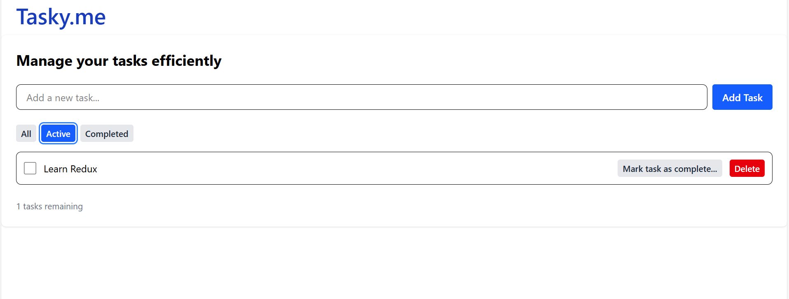

# Tasky.me
A modern and responsive Task Management application built with React + TypeScript that helps you organize, prioritize, and track your tasks efficiently.
Users can add, delete, and mark tasks as complete — all with smooth validation and a clean UI.

# Features
- Add new tasks with validation
- Delete existing tasks
- Mark tasks as completed 
- Responsive UI with TailwindCSS
- Reusable, type-safe components (TypeScript)
- Custom React hooks for form error validation and use of local storage for data persistence
- Light and fast — no backend required 

# Tech Stack
Frontend -	React (TypeScript)
Styling	- Tailwind CSS
State Management -	React Hooks (useState, useEffect)
Validation -	Custom Hook (useValidation)
Build Tool -	Vite
# Screenshots

# Future Enhancements
- Add backend for API and Storage
- Add due dates and filters
- Add dark mode toggle